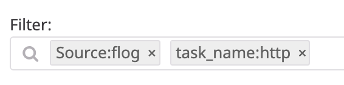
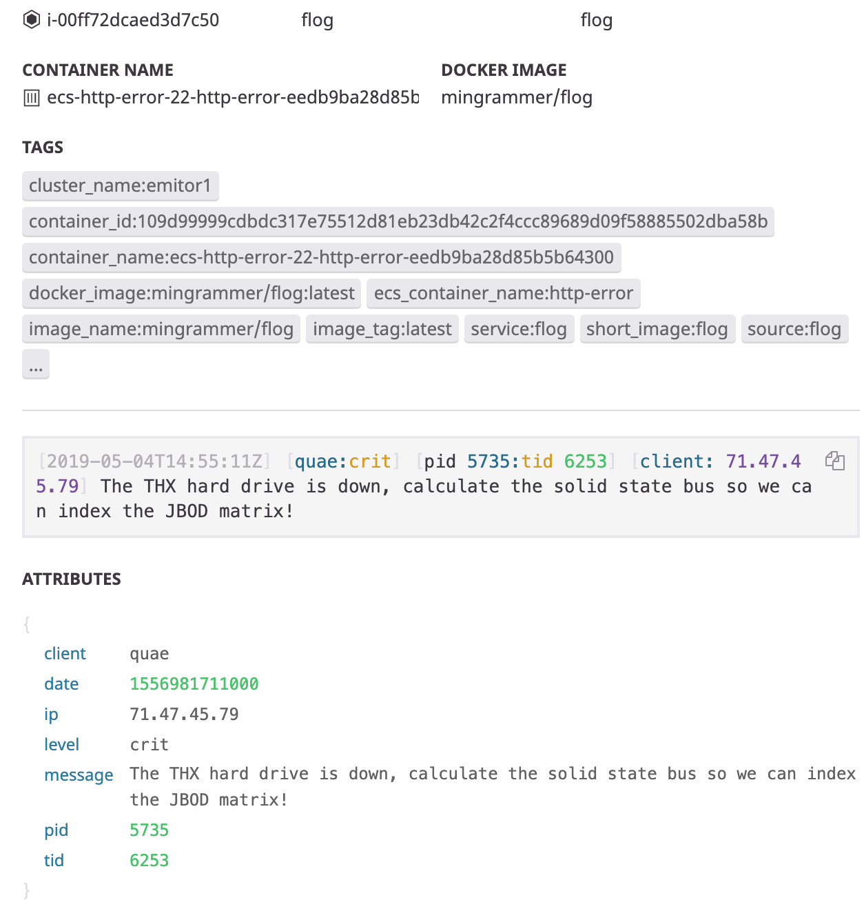

# datadog-log-testing

* [datadog-log-testing](#datadog-log-testing)
  * [Intro](#intro)
  * [Requirements](#requirements)
  * [Deployment](#deployment)
  * [Configuration](#configuration)
    * [Setup log pipelines](#setup-log-pipelines)
    * [Setup grok parsers](#setup-grok-parsers)
    * [Confirm attributes parsed correctly](#confirm-attributes-parsed-correctly)
  * [Benchmarking](#benchmarking)
    * [Methodology](#methodology)
    * [Run the script](#run-the-script)

## Intro

A Terraform module to provision an ECS Cluster that uses [flog](https://github.com/mingrammer/flog) to randomly generate **HTTP**, **HTTP-Error** and **Syslog** events that are pushed to Datadog by the Datadog ECS Agent.

The ECS cluster runs four tasks: `http`, `http-error`, `syslog`, `datadog-agent`.

With a default configuration you should expect around 400million log events per day or 40GB.

## Requirements

1. A Datadog account
2. Terraform >=0.11
3. Python >=3.4

## Deployment

1. `cd terraform`
2. `terraform init`
3. `terraform apply`

**Note:** You will be prompted for required variables including your Datadog API key.

## Configuration

At this point you should have logs flowing into Datadog and they should be visible in your [log dashboard](https://app.datadoghq.com/logs).

To be able to use the benchmarking script you must first setup a [log pipeline](https://docs.datadoghq.com/logs/processing/) for each ECS task (log type).  The pipeline and associated Grok log parser will parse the log events into attributes, eg it will turn this:

```text
[2019-05-04T14:55:12Z] [dolor:crit] [pid 1289:tid 3984] [client: 3.181.132.201] Use the auxiliary RSS firewall, then you can connect the cross-platform microchip!
```

Into this:

```json
{
  "client": "dolor",
  "date": 1556981712000,
  "ip": "3.181.132.201",
  "level": "crit",
  "message": "Use the auxiliary RSS firewall, then you can connect the cross-platform microchip!",
  "pid": 1289,
  "tid": 3984
}
```

### Setup log pipelines

Three log generator tasks run as part of the ECS cluster:

1. `http`
2. `http-error`
3. `syslog`

You need to setup a pipeline for each task in the [log pipelines dashboard](https://app.datadoghq.com/logs/pipelines):

1. Add a pipeline with a filter to filter on the ECS task name:
    
    * The values should be one of `http`, `http-error`, `syslog`
2. Name the filter appropriately for each ECS task: `HTTP`, `HTTP-Error`, `Syslog`

### Setup grok parsers

You need to setup a grok parser for each task in the [log pipelines dashboard](https://app.datadoghq.com/logs/pipelines).

Eg, for each pipeline created previously:

1. Add a grok parser with one of the following stanzas:
    * **http**

    ```grok
    Rule %{ip:ip} - %{word:UserAgent} %{integer:} \[%{date("yyyy-MM-dd'T'HH:mm:ss'Z'"):date}\] "%{word:method} %{data:path}" %{integer:response_code} %{integer:response_bytes}
    ```

    * **http-error**

    ```grok
    Rule \[%{date("yyyy-MM-dd'T'HH:mm:ss'Z'"):date}\] \[%{word:client}:%{word:level}\] \[pid %{number:pid}:tid %{number:tid}\] \[client: %{ip:ip}\] %{data:message}
    ```

    * **syslog**

    ```grok
    Rule \<%{number:}\>%{date("MMM dd HH:mm:ss"):date} %{word:user} %{data:exception}: %{data:message}
    ```

### Confirm attributes parsed correctly

You should now see attributes for each log type in the [log dashboard](https://app.datadoghq.com/logs)

See this example **http-error** log, attributes are displayed at the bottom:
    

If not you'll need to tweak your log pipelines and parsers until you can confirm that attributes are being parsed correctly, before moving on to benchmarking.

## Benchmarking

An example Python3 CLI script is included to provide basic benchmarking accross different timeframes.  You'll need to fill out the API and APP key variables on lines 7-8.

**Note:** The script relies on attributes being correctly parsed through the log pipelines.  If you have not yet setup log pipelines and parsers as part of the configuration you will not be able to run benchmarking successfully.

### Methodology

The script will perform three searches across each of the following timeframes:

* now - 1h
* now - 12h
* now - 1d
* now - 2d
* now - 4d
* now - 8d
* now - 16d

For each timeframe it will first retrieve 1000 ip addresses from the ip attribute of the `task_name: http` task.  Three of those ip addresses are selected at random and a subsequent plain-text search is performed for matching similar ip addresses.

The results of each search are displayed for every timeframe.

**Note:**
As Datadog does not provide any performance data or query execution time in their API, the `requests` library `elapsed.total_seconds()` call has been used to provide an approximation.  These results should certainly not be considered accurate query times. However they provide a way to identify patterns in total response time from the API over different timeframes.

### Run the script

**Note:** Remember to fill out the API and APP key variables on lines 7-8.

```bash
./benchmark.py

Using Timeframe: now - 1h
  Searching for: 4.161.16.*         8 results       0.424911 seconds
  Searching for: 181.136.136.*      2 results       0.38215 seconds
  Searching for: 4.162.128.*        2 results       0.351771 seconds


Using Timeframe: now - 12h
  Searching for: 234.76.84.*        3 results       0.37513 seconds
  Searching for: 56.147.145.*       5 results       0.355831 seconds
  Searching for: 20.212.123.*       6 results       0.358365 seconds


Using Timeframe: now - 1d
  Searching for: 105.229.26.*       14 results      0.486284 seconds
  Searching for: 101.71.113.*       10 results      0.595983 seconds
  Searching for: 196.82.246.*       9 results       0.746434 seconds


Using Timeframe: now - 2d
  Searching for: 62.136.24.*        24 results      1.752162 seconds
  Searching for: 172.84.241.*       18 results      1.193873 seconds
  Searching for: 135.203.203.*      22 results      1.511429 seconds


Using Timeframe: now - 4d
  Searching for: 26.148.248.*       41 results      2.264032 seconds
  Searching for: 139.233.12.*       39 results      2.548176 seconds
  Searching for: 144.96.127.*       52 results      3.088091 seconds


Using Timeframe: now - 8d
  Searching for: 41.143.156.*       82 results      4.156319 seconds
  Searching for: 134.141.41.*       78 results      5.825342 seconds
  Searching for: 106.7.87.*         85 results      3.075591 seconds


Using Timeframe: now - 16d
  Searching for: 187.86.72.*        162 results     10.946819 seconds
  Searching for: 36.230.60.*        130 results     10.65015 seconds
  Searching for: 118.167.62.*       116 results     8.269539 seconds
```
